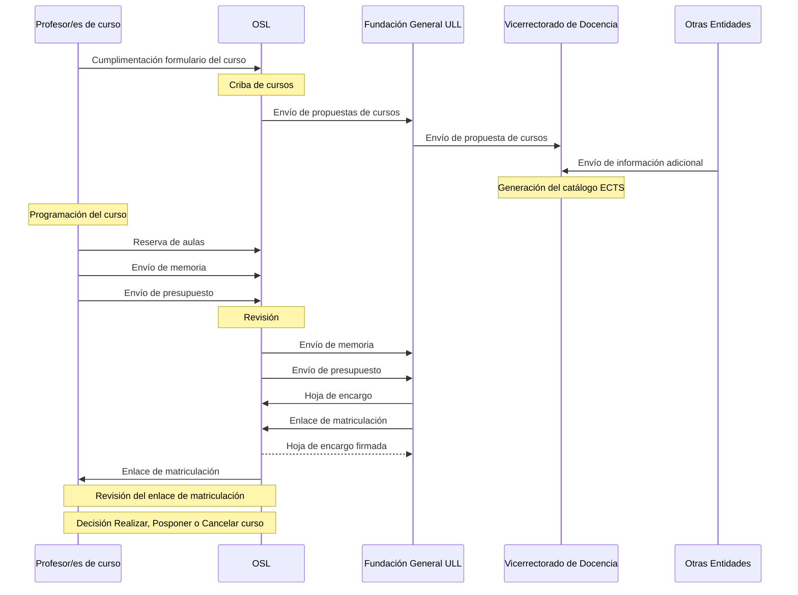
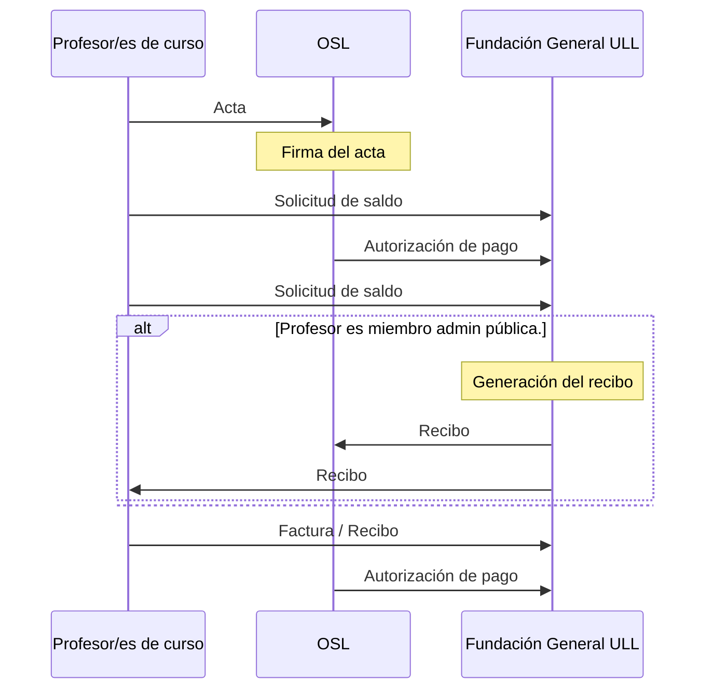
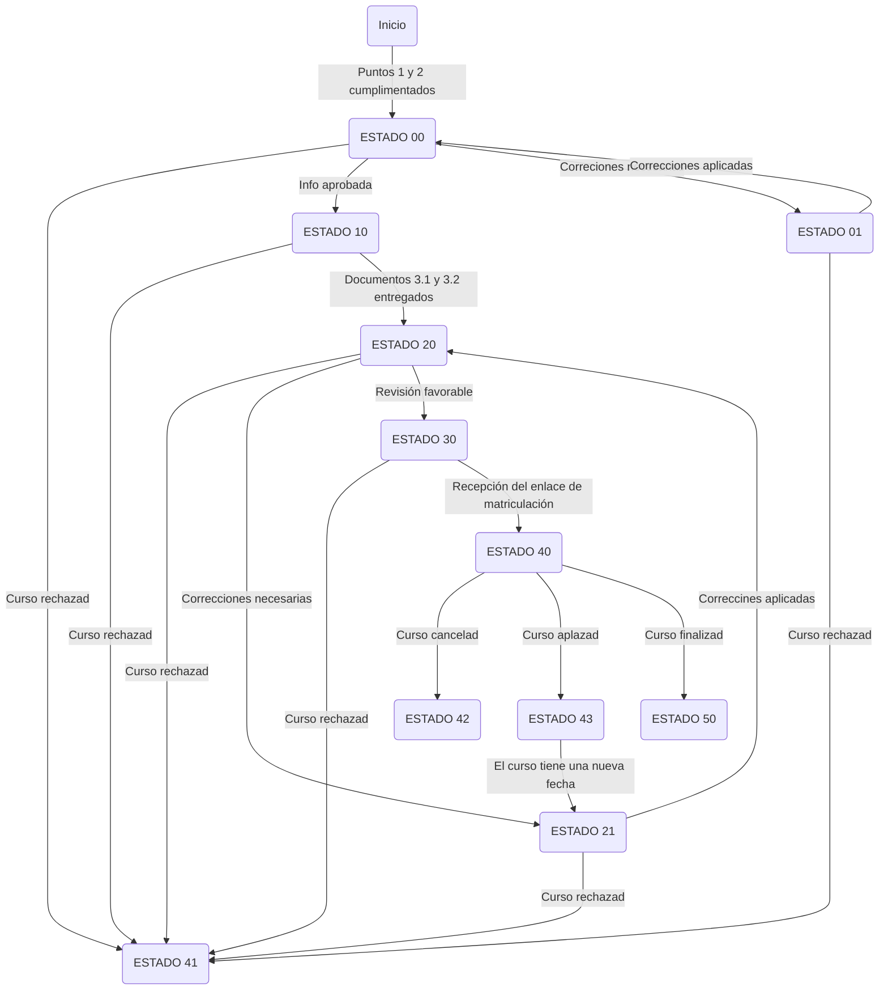
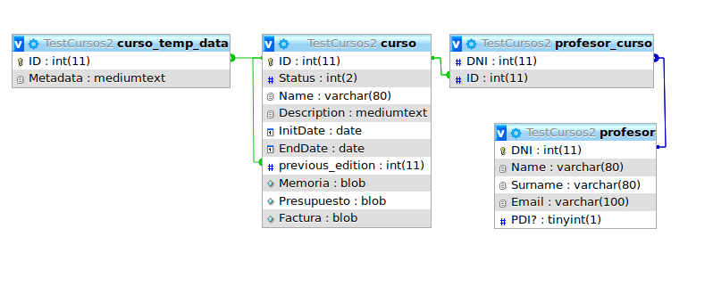
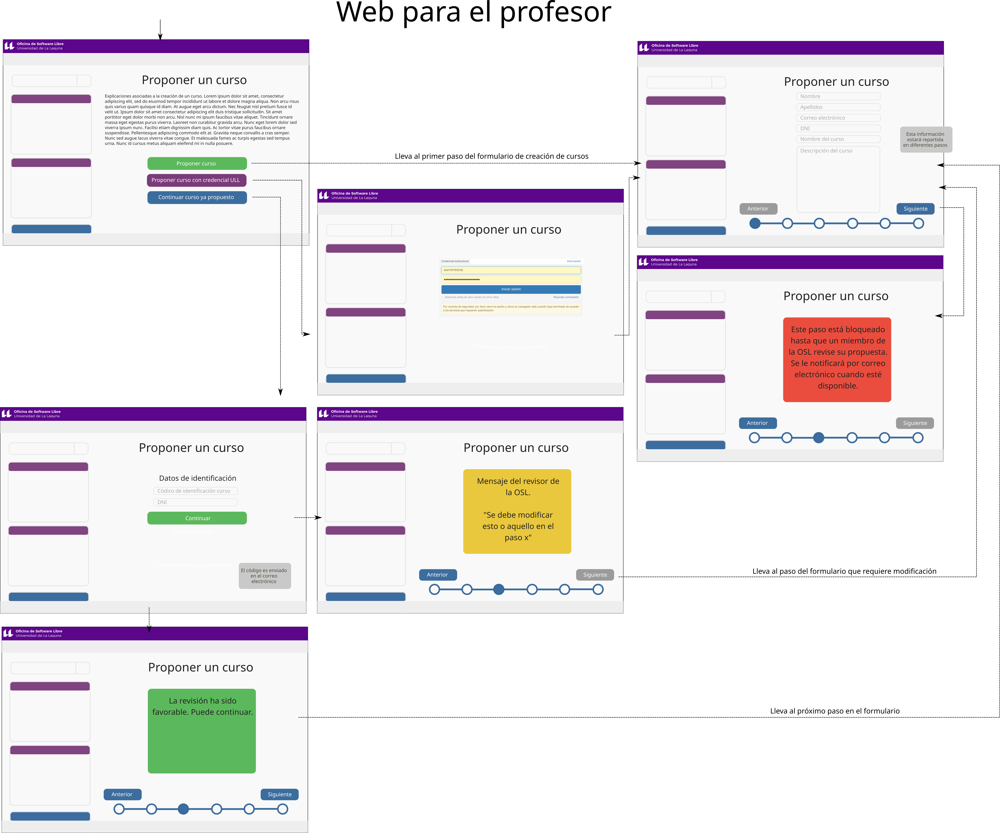

# GeDiCur

- Daniel Darias Sánchez
- alu0100783230@ull.edu.es

## Introducción
El presente documento trata de establecer una propuesta de un nuevo protocolo a 
seguir para la propuesta de cursos ofertados por la OSL / FGULL. Para ello se ha tomado como punto
de partida el sistema empleado actualmente, basado en gran parte en formularios de 
*google docs* y correos electrónicos individuales y se ha tratado de identificar los
pasos claves y sus actores a fin de establecer un nuevo sistema simplificado y unificado
que se estima repercutirá en una mayor facilidad en los trámites para todos los
individuos implicados. Así mismo, este nuevo protocolo es acompañado de un proptotipo 
funcional de plugin wordpress listo para su inclusión en el portal web de la OSL.

De forma general y a modo de resumen, comenzaremos explicando en qué consiste el
sistema de cursos de la FGULL / OSL con el objetivo de acotar el ámbito de este proyecto:

- La Fundación General de la Universidad de La Laguna (FGULL) es una entidad cuyo objetivo es 
servir de nexo entre la Universidad en sí y la sociedad. Entre sus tareas se encuentran
la formación especializada, transferencia del conocimiento e investigación, 
gestión de la innovación, formación, emprendimiento, fomento de la inserción laboral, movilidad, 
etc. Ciñéndonos a las labores de formación, la FGULL oferta una serie de cursos en su 
*catálogo formativo* y se encarga de la gestión de matrículas, campus virtuales, pago por
parte de los alumnos, etc. de los mismos. 

- La Oficina de Software Libre (OSL) es un órgano encargado de la difusión del software
libre tanto dentro como fuera de la universidad, meta que es perseguida mediante 
la consecución de diferentes actividades y proyectos entre los cuáles está la 
creación de cursos sobre el uso de tecnologías libres. 

Es fácil ver pues, que la relación existente entre ambas entidades es la inclusión
de cursos promovidos por la OSL en el catálogo generado por la FGULL. Estos cursos
además son impartidos en las aulas que la OSL gestiona en las bibliotecas de 
Guajara y Anchieta.

Es pues el ámbito de aplicación de esta propuesta de mejora todos aquellos pasos desde
el momento que un profesor/a o conjunto de los mismos deciden realizar un curso hasta 
que este se ha terminado, los alumnos evaluados y las gestiones relacionadas con los 
pagos han finalizado igualmente, restringido a aquellos cursos en los que la OSL también
está implicada.

## Flujo de trabajo actual

En primera instancia, se ha estudiado el modelo actual, distinguiéndose en el mismo
las siguientes 3 fases:

- Planificación: Ataña los trámites a realizar por profesores, OSL, FGULL y otras entidades
desde la proposición inicial de un curso hasta que se genera el enlace de matriculación
en la FGULL.
- Difusión: Comprende las labores de publicidad y captación de posibles interesados en 
asistir como alumnos de los cursos.
- Cierre: Identifica los pasos finales como el envío de documentación de pago y el 
cierre de actas.

A continuación se detallan estos tres puntos con la ayuda de diagramas de secuencia.

### Fase de planificación


### Fase de difusión

- Publicación catálogo mensual cursos FGULL
- Publicación web OSL
- Diseño e impresión del cartel
- Artículo blog osl
- Newsletters mensuales ESIT-Informática
- Difusión en RRSS
- Envío listas de correo
- Charla presentación curso (en caso de que se reúnan 4 personas)

### Fase de cierre



# Propuesta

Una vez estudiados pasos / actores implicados en el proceso, presentamos primeramente
un listados de desventajas encontradas.

- Comunicación manual entre actores. Notablemente entre Profesores, OSL y FGULL. El 
envío de información se lleva a cabo mediante correos electrónicos.
- Descentralización de la información. La falta de una base de datos unificada que 
contenga todos los cursos independientemente de su estado obliga a generar ficheros
a mano como la web listado de cursos de la OSL. Comprobar el estado de un curso
requiere comprobar correos.

Esta propuesta pretende dar respuesta a estos problemas a través del uso de un 
sistema unificado y el uso de formularios simplificados y consistentes que pretenden
disminuir el tedio de los correos electrónicos manuales, permitir la visualización global
de todos los cursos y servir de base para posibles automatizaciones futuras. 
Se centra en los actores Profesor y OSL ya que la FGULL es una entidad aparte 
sobre la que la OSL no tiene control.

El sistema se basa en la definición de una serie de estados a través de los cuales
un curso va transicionando y en cada uno de los cuáles se permite realizar una serie 
de acciones y/o se disparan ciertos eventos.

## Proceso:

1. El profesor realiza un envío inicial con información acerca del curso que quiere realizar 
a través de un formulario generado por el plugin. 
Esta información es categorizada en una base de datos que se consulta 
desde el panel de administrador del plugin por parte de un miembro de 
la OSL que actúa de *revisor*. Durante el transcurso de aprobación de un curso este 
transiciona por diferentes estados los cuales están detallados con posterioridad en este informe. 
El sistema informa por correo electrónico al profesor cada vez 
que se ha avanzado un paso en la gestión hasta que el curso es finalmente 
`APROBADO` o `RECHAZADO`.

3. Una vez `APROBADO` el curso, este es accesible desde el panel de administración 
del plugin en el cual puede cambiarse su **estado** (*cancelado*, *aplazado*, 
*pendiente de cambios*, etc.). Las modificaciones realizadas aquí deberían 
reflejarse en el envío de correos, tuits, etc.

3. Un curso `APROBADO` es mostrado en la [web de cursos de la osl](https://osl.ull.es/formacion/)
en conjunto de su información asociada (**estado**, fechas de inicio y finalización, etc.).
Desde esta sección cualquiera debería poder realizar acciones como compartir, comentar, etc.

4. Un curso `RECHAZADO` (descartado durante la fase 1) nunca aparecerá en la web de cursos de la osl.

### Información requerida para un curso

Una propuesta de curso, en el momento inmediatamente anterior a ser `APROBADO` debe 
incluir la siguiente información:

| Info de los ponentes (una entrada por profesor) [1] | Info general del curso [2] | Documentos [3] |  
|---|---|---|
| Nombre   | Título   |  Memoria [1]  |   
| Apellido  | Descripción   | Presupuesto [2]  |   
| DNI  | Número de horas   | Factura / Recibo [3]  |   
| Email  | Fecha de inicio   |   |   
| Es PDI de la ULL?  | Fecha de finalización   |   |   
| | Público objetivo   |   |   
| | Edición previa   |   |   

## Estados de un curso 

| Código  | Estado  | Información adicional |  
|----|-------------|---|
| 00 | `PROPUESTA (Esperando revisión)` | Se ha enviado la información correspondiente a los puntos 1 y 2 y se espera su revisión
| 01 | `PROPUESTA (Esperando al profesor)` | Hay información correspondiente a los puntos 1 y 2 que debe ser corregida
| 10 | `PROPUESTA (Esperando al profesor)` | La información de los puntos 1 y 2 ha sido aprobada.
| 20 | `PROPUESTA (Esperando revisión)` | Los documentos 3.1 y 3.2 han sido enviados y se espera su revisión.
| 21 | `PROPUESTA (Esperando al profesor)` | Se deben realizar correcciones en los documentos 3.1 y/o 3.2
| 30 | `PROPUESTA (Esperando revisión)` | Los documentos 3.1 y 3.2 han sido aprobados. En espera del enlace de matriculación
| 40 | `APROBADO`  |
| 41 | `RECHAZADO` | A este estado es posible transicionar en cualquier momento del proceso de creación. Estado de muerte
| 42 | `CANCELADO` | A este estado es posible transicionar únicamente una vez se ha aprobado. Estado de muerte.
| 43 | `RETRASADO (Esperando revisión)` | Idealmente se volvería a un estado anterior como el 01 ó 21
| 50 | `FINALIZADO`| El curso se ha impartido. Estado de muerte.

Las tranciones entre estados vienen definidas por el siguiente diagrama:

### Diagrama de estados



#### Tabla de transiciones

| Estado| 00 | 01 | 10 | 20 | 21 | 30 | 40 | 41 | 42 | 43 | 50 |
|-------|----|----|----|----|----|----|----|----|----|----|----|
| 00    |    | xx | xx |    |    |    |    | xx |    |    |    |
| 01    | xx |    |    |    |    |    |    | xx |    |    |    |
| 10    |    |    |    | xx |    |    |    | xx |    |    |    |
| 20    |    |    |    |    | xx | xx |    | xx |    |    |    |
| 21    |    |    |    | xx |    |    |    | xx |    |    |    |
| 30    |    |    |    |    |    |    | xx | xx |    |    |    |
| 40    |    |    |    |    |    |    |    |    | xx | xx | xx |
| 41    |    |    |    |    |    |    |    |    |    |    |    |
| 42    |    |    |    |    |    |    |    |    |    |    |    |
| 43    |    |    |    |    | xx |    |    |    |    |    |    |
| 50    |    |    |    |    |    |    |    |    |    |    |    |

### Diagrama de secuencia, caso favorable

Respetando el esquema en 3 fases descrito anteriormente, distinguimos la siguiente secuencia
de proposición y aceptación de un curso para un caso en el cual es finalmente aprobado.
Como ya se ha dicho, las interacciones entre OSL y FGULL no pertenecen al ámbito de 
este proyecto.

```mermaid
sequenceDiagram

	participant P as Profesor/es
	participant S as Sistema 
	participant R as Revisor
	participant C as Curso

	activate P
	P->>+S: Acceso a la plataforma
	S-->>P: Petición de información del curso  (puntos 1 y 2)
	P->>-S: Información del curso (puntos 1 y 2)
	S-->C: 

	loop Fase de revisión 1
		Note over C: ESTADO 00 
		S->>R: Posible notificación
		deactivate P

		activate R
		R-->>+S: Revisión de la información
		deactivate R
		alt Revisión NEGATIVA
			S->>+P: Petición de modificación
			S-->C: 
			Note over C: ESTADO 01
			P-->>S: Información corregida
			deactivate P
		else Revisión POSITIVA, ENDLOOP
			S->>P: Información aprobada				
		end		
	end

	S-->C: 
	Note over C: ESTADO 10
	activate P
	P->>+S: Memoria
	P->>S: Presupuesto
	deactivate P
	S-->C: 

	loop Fase de revisión
		Note over C: ESTADO 20
		S->>R: Posible notificación
		deactivate P

		activate R
		R-->>+S: Revisión de la información
		deactivate R
		alt Revisión NEGATIVA
			S->>+P: Petición de modificación
			S-->C: 
			Note over C: ESTADO 21
			P-->>S: Información corregida
			deactivate P
		else Revisión POSITIVA, ENDLOOP
			S->>P: Información aprobada							
		end		
	end

	activate P
	S-->C: 
	Note over C: Estado 30
	
	R->>S: Enlace de matriculación
	S->>P: Enlace de matriculación	

	S-->C: 
	Note over C: Estado 40	
```

## BBDD ejemplo 
 


- Los cursos en fase de aprobación tienen entradas en las tablas *curso*, 
*profesor_curso*, *profesor* y *curso_temp_data*. Una vez el curso es `APROBADO`
y la información temporal ya no es necesaria desaparece su entrada en la 
tabla *curso_temp_data*. 

- Mientras el curso permanece en un estado de `PROPUESTA` las entradas en 
*curso_temp_data* contienen la retroalimentación hecha por parte de la OSL.
En caso de concurrir en un estado final diferente a `APROBADO` (`RECHAZADO`, `APLAZADO` o 
`CANCELADO`) contendrá el motivo del mismo.

- La reedición de cursos se contempla mediante la columna `previous_edition` 
de la tabla *cursos* que permanece a NULL para la primera (o única) edición de 
un curso y señala a la edición inmediatamente anterior en el resto de casos.


## Mockups




# Todo


* Autenticación usuario wordpress
* Incidencias: correo electrónicos a osl.soporte@soporte.ull.es [Curso]
* Diferencia formación para alumnos/externos y para profesorado